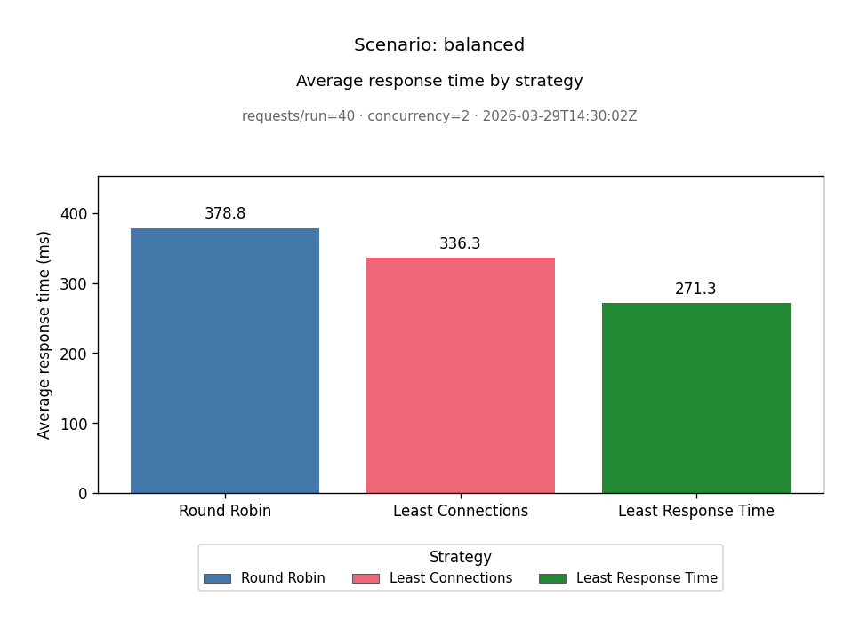
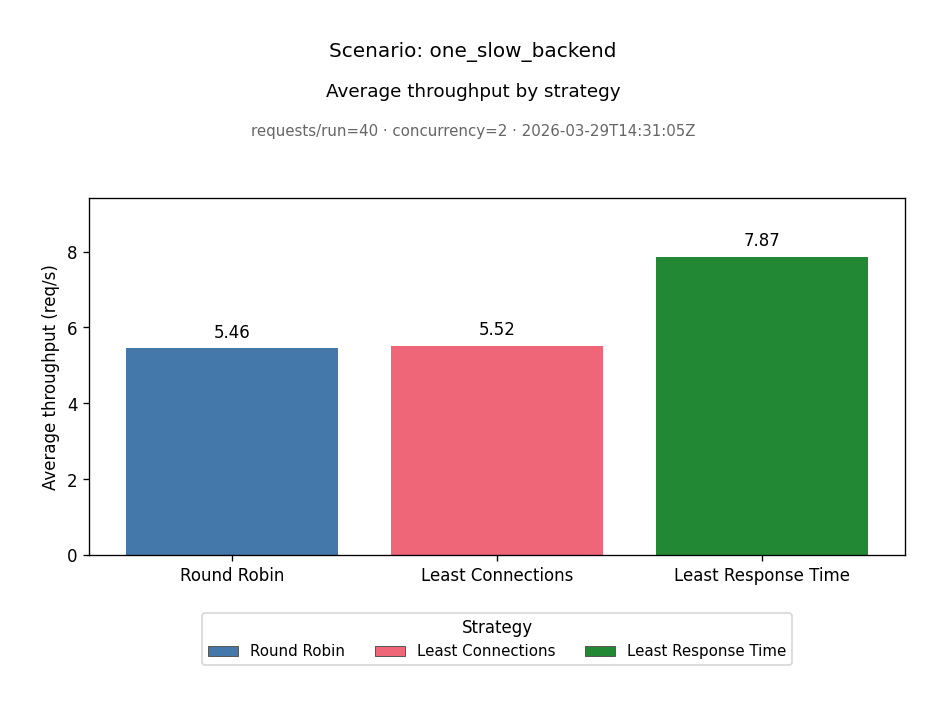
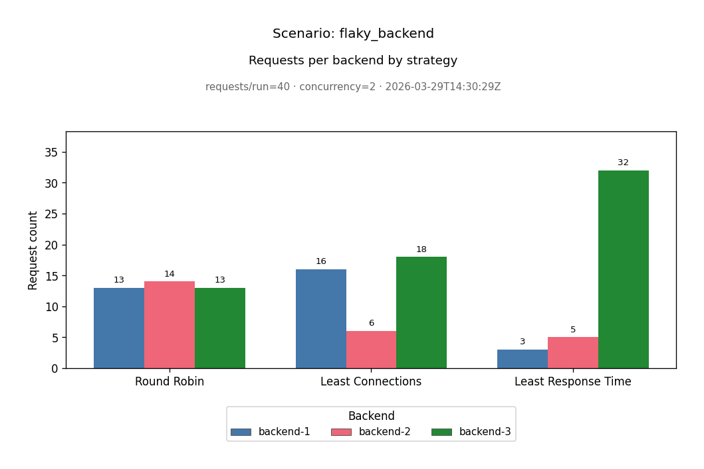

# Load Balancer Simulator

A small **local, educational** Python project: a FastAPI reverse-proxy load balancer, synthetic backends, and tools to compare routing strategies under configurable conditions. It is meant for learning and experimentation—not a production load balancer.

## Highlights

- **Modular strategies**: Round Robin, Least Connections, and Least Response Time (`app/strategies.py`), selected via `LB_STRATEGY`.
- **Overload protection (fail-fast)**: configurable max in-flight requests at the balancer; excess requests are rejected with HTTP 503 (`LB_MAX_IN_FLIGHT`).
- **Backend behavior simulation**: per-backend fixed delay, jitter, and failure rate (environment-driven, `app/config.py` + `app/backend_server.py`).
- **Scenario-based benchmarking**: named presets (`app/benchmark_scenarios.py`); the benchmark runner can start backends for you (`--scenario`).
- **Benchmark overload capture**: per-strategy counts for HTTP `503` overload rejections vs other failures, plus success-only throughput (`overload_rejected_requests`, `successful_throughput_rps`); optional `--lb-max-in-flight` on the runner to saturate the balancer locally.
- **Self-describing benchmark JSON**: scenario metadata, workload parameters, and per-strategy metrics ([Results](#results); structure in [Benchmark outputs](#benchmark-all-strategies-same-workload)).
- **Chart export**: matplotlib CLI turns `benchmark_summary_*.json` into PNG charts ([Visualizing benchmark results](#visualizing-benchmark-results); committed samples under [`examples/`](examples/README.md)).
- **Automated tests**: pytest—unit (strategies), integration-style (balancer), smoke (benchmark output shape) ([Automated testing](#automated-testing)).

## Demo / Example Results

Static charts below come from [`app/visualize_results.py`](app/visualize_results.py) using committed benchmark JSON under [`examples/`](examples/README.md). Workload for these samples: **40** requests per strategy, **2** concurrent workers, **1** repetition per strategy.

**Balanced scenario** — average response time (ms) per strategy. Similar backend tuning yields comparable latency; strategies still differ slightly in measured averages.



**One slow backend** — average throughput (req/s) per strategy. One deliberately slow backend shifts how much useful work each strategy completes per second.



**Flaky backend** — request counts per backend and strategy. One backend simulates intermittent HTTP 500s; distribution shows how routing responds under partial failure.



See [`examples/README.md`](examples/README.md) for full JSON, CSV, and per-scenario chart sets.

## Quick Start

From the project root (Python 3.x):

```bash
python -m venv .venv
source .venv/bin/activate   # Windows: .venv\Scripts\activate
pip install -r requirements.txt
```

Run one **named scenario** (benchmark runner starts backends and the load balancer; keep ports **8000–8003** free):

```bash
python -m app.benchmark_runner --scenario balanced --requests 200 --concurrency 3 --repetitions 1
```

Build **charts** from the latest benchmark JSON (writes PNGs under `charts/` by default):

```bash
python -m app.visualize_results "$(ls -t results/benchmark_summary_*.json | head -1)"
```

To explore without a local run, use committed outputs in [`examples/`](examples/README.md). For manual backends, step-by-step processes, and full CLI options, see [Setup](#setup) and the sections below.

---

## Overview

The project simulates routing HTTP `GET` traffic from a single load balancer entrypoint to three backend instances. You can compare how different algorithms distribute work and how latency, jitter, and failures affect outcomes—on your machine, with no cloud or cluster required.

## Current features

**Backends (FastAPI, ports 8001–8003 by default)**

- `GET /` — identifies the server; optional simulated processing via delay, jitter, and random HTTP 500s.
- `GET /health` — quick OK response (no artificial delay).
- Behavior configured with env vars (global or per-backend), documented below.

**Load balancer (FastAPI, default port 8000)**

- `GET /` — forwards to a chosen backend using HTTP (`requests`); response includes which backend served the request (`X-Backend`).
- TCP socket reachability checks before routing; unreachable backends are skipped.
- Strategy pluggable via `LB_STRATEGY`: `round_robin`, `least_connections`, `least_response_time`.
- Overload guard via `LB_MAX_IN_FLIGHT` (default `100`): when active in-flight requests hit the limit, new requests fail fast with HTTP `503`.
- `GET /lb/status` — minimal local status/metrics (`active_requests`, `rejected_requests_total`, `peak_active_requests`, `max_in_flight_requests`).

**Client simulator**

- Sends many `GET /` requests to the balancer; optional concurrency and periodic progress output.
- Collects success counts, **non-overload** failure counts, **overload `503`** counts (distinct from other errors), latency stats, offered-load and success-only throughput, and per-backend (or overload-bucket) counts; writes JSON under `results/`.

**Benchmark runner**

- Runs all three strategies under the **same** workload (requests, concurrency, timeout, path).
- Optional **`--scenario`** — starts and stops all three backends with a named preset from `app/benchmark_scenarios.py`.
- Optional **`--lb-max-in-flight`** — when set, each per-strategy load balancer child process uses that `LB_MAX_IN_FLIGHT` (combine with high `--concurrency` and scenario `overload_saturation` to record many `503` overload responses).
- Writes **JSON + CSV** comparison files under `results/` (see [Results](#results)); strategy rows include `overload_rejected_requests` and `successful_throughput_rps`, and `benchmark_parameters` may include `load_balancer_max_in_flight`.

**Visualization**

- CLI script reads one benchmark JSON and writes comparison charts (PNG) under `charts/` by default.

## Automated testing

Tests are a first-class part of the project: they keep strategy and routing logic safe to change and document expected behavior for interviews and demos.

The suite uses **pytest** with **no heavy infrastructure** (no Docker, no cloud). It is split into three groups:

| Group | Location | What it covers |
|-------|----------|----------------|
| **Unit** | `tests/unit/` | Strategy selection (round robin rotation, least-connections preference, least-response-time averages, tie-breaking); named scenario registry and serialization. |
| **Integration-style** | `tests/integration/` | FastAPI `TestClient` against the load balancer app with **mocked** HTTP to backends—forwarding, skipping unhealthy backends, propagating backend error responses. Not a full multi-process network test. |
| **Smoke** | `tests/smoke/` | Benchmark runner **output**: JSON shape and file creation with mocked subprocesses and simulator (fast, deterministic). |

Run everything:

```bash
source .venv/bin/activate
pytest
```

Run by group:

```bash
pytest tests/unit
pytest tests/integration
pytest tests/smoke
```

## Results

The `results/` directory (created automatically) holds JSON (and optional CSV) from local runs:

| Source | Typical files | Contents |
|--------|----------------|----------|
| Client simulator | `simulation_<label>_<timestamp>.json` | Metrics for one manual run against a load balancer you started (label from `--strategy-label`). |
| Benchmark runner | `benchmark_summary_<timestamp>.json`, `benchmark_comparison_<timestamp>.csv` | Side-by-side strategy comparison for one benchmark session. |

These files are for **local experimentation and later comparison** (e.g. before/after a change, or across scenarios). They are not uploaded or analyzed by the project itself.

The repository also includes **sample benchmark outputs and charts** in [`examples/`](examples/README.md) for documentation and portfolio use.

## Technologies

- Python 3.x
- FastAPI, Uvicorn
- `requests` (HTTP forwarding and client traffic)
- TCP sockets (reachability checks)
- matplotlib (optional: benchmark chart export)
- pytest, httpx (tests only)

## Visualizing benchmark results

After a benchmark run, turn `results/benchmark_summary_*.json` into static charts using **matplotlib** (included in `requirements.txt`). No web UI.

**Minimal flow** (same as [Quick Start](#quick-start)): point `app.visualize_results` at a summary JSON; optional `-o` sets the output directory (default `charts/`).

<details>
<summary><strong>More commands and options</strong> (alternate scenarios, manual backends, latest file helper)</summary>

**1. Generate a benchmark JSON** (pick one experiment configuration):

```bash
source .venv/bin/activate
# Named scenario (runner starts backends; frees ports 8000–8003)
python -m app.benchmark_runner --scenario balanced --requests 200 --concurrency 3 --repetitions 1

# Another experiment: different scenario or workload
python -m app.benchmark_runner --scenario flaky_backend --requests 300 --concurrency 5 --timeout 5.0 --repetitions 2

# Or manual backends (you start 8001–8003 yourself), no --scenario
python -m app.benchmark_runner --requests 200 --concurrency 1
```

Each run writes a **new** file like `results/benchmark_summary_YYYYMMDD_HHMMSS.json` (and a CSV). The filename encodes the time of the run so experiments do not overwrite each other.

**2. Build charts from that JSON** (use the exact path of the file you care about):

```bash
python -m app.visualize_results results/benchmark_summary_YYYYMMDD_HHMMSS.json
```

Optional: choose output folder (default is `charts/`):

```bash
python -m app.visualize_results results/benchmark_summary_YYYYMMDD_HHMMSS.json -o charts
```

**3. Latest benchmark file** (shell helper):

```bash
python -m app.visualize_results "$(ls -t results/benchmark_summary_*.json | head -1)"
```

**Different experiments = different benchmark runs.** Change `--scenario`, `--requests`, `--concurrency`, `--timeout`, or backend setup (manual mode), run the benchmark again, then point `visualize_results` at the new `benchmark_summary_*.json`. Each visualization produces three PNGs **prefixed with that JSON’s stem**, so results from multiple experiments stay separate in `charts/`.

</details>

### Outputs (three PNG files per input JSON)

| File suffix | Chart |
|-------------|--------|
| `_response_time.png` | Bar chart: **average response time (ms)** per strategy |
| `_throughput.png` | Bar chart: **average throughput (req/s)** per strategy |
| `_backend_distribution.png` | Grouped bar chart: **request counts per backend**, one group per strategy |

Each chart includes a **color legend below the plot** (outside the axes) so labels never cover the bars: strategy name on the first two charts, backend name on the distribution chart.

Titles include the **scenario name** (if present in the JSON) and a short subtitle with request count, concurrency, and `generated_at` when available. Generated PNGs under the repo-root `charts/` directory are gitignored (see `.gitignore`); committed demo charts live under [`examples/`](examples/README.md).

## Project structure

- `app/config.py` — backend list, load-balancer strategy env, backend behavior resolution
- `app/backend_server.py` — backend FastAPI app
- `app/load_balancer.py` — load balancer FastAPI app
- `app/healthcheck.py` — TCP health checks
- `app/strategies.py` — strategy abstraction and implementations
- `app/client_simulator.py` — load generator and metrics
- `app/benchmark_runner.py` — multi-strategy benchmark CLI
- `app/benchmark_scenarios.py` — named scenario definitions
- `app/visualize_results.py` — matplotlib CLI: benchmark JSON → PNG charts
- `examples/` — committed demo benchmark JSON/CSV + charts ([`examples/README.md`](examples/README.md))
- `tests/` — pytest tests (`unit`, `integration`, `smoke`)

## Setup

Create a virtual environment and install dependencies:

```bash
python -m venv .venv
source .venv/bin/activate
pip install -r requirements.txt
```

## Run the 3 backend services

Open 3 terminals (or run in the background). Each backend runs the same code, but on a different port + name.

Terminal 1:

```bash
source .venv/bin/activate
BACKEND_NAME=backend-1 uvicorn app.backend_server:app --host 127.0.0.1 --port 8001
```

Terminal 2:

```bash
source .venv/bin/activate
BACKEND_NAME=backend-2 uvicorn app.backend_server:app --host 127.0.0.1 --port 8002
```

Terminal 3:

```bash
source .venv/bin/activate
BACKEND_NAME=backend-3 uvicorn app.backend_server:app --host 127.0.0.1 --port 8003
```

<details>
<summary><strong>Optional backend behavior configuration</strong> (delay, jitter, failure rate via env vars)</summary>

Each backend can simulate:

- fixed delay in milliseconds
- additional random jitter in milliseconds
- failure rate between `0.0` and `1.0`

Global env vars (applies to all backends):

- `BACKEND_FIXED_DELAY_MS`
- `BACKEND_JITTER_MS`
- `BACKEND_FAILURE_RATE`

Backend-specific env vars (override global values):

- `BACKEND_1_FIXED_DELAY_MS`, `BACKEND_1_JITTER_MS`, `BACKEND_1_FAILURE_RATE`
- `BACKEND_2_FIXED_DELAY_MS`, `BACKEND_2_JITTER_MS`, `BACKEND_2_FAILURE_RATE`
- `BACKEND_3_FIXED_DELAY_MS`, `BACKEND_3_JITTER_MS`, `BACKEND_3_FAILURE_RATE`

Example with different behavior per backend:

```bash
# backend-1: fast and stable
BACKEND_NAME=backend-1 BACKEND_1_FIXED_DELAY_MS=80 BACKEND_1_JITTER_MS=20 BACKEND_1_FAILURE_RATE=0.00 uvicorn app.backend_server:app --host 127.0.0.1 --port 8001
```

```bash
# backend-2: slower but stable
BACKEND_NAME=backend-2 BACKEND_2_FIXED_DELAY_MS=350 BACKEND_2_JITTER_MS=120 BACKEND_2_FAILURE_RATE=0.00 uvicorn app.backend_server:app --host 127.0.0.1 --port 8002
```

```bash
# backend-3: medium speed with occasional failures
BACKEND_NAME=backend-3 BACKEND_3_FIXED_DELAY_MS=180 BACKEND_3_JITTER_MS=80 BACKEND_3_FAILURE_RATE=0.10 uvicorn app.backend_server:app --host 127.0.0.1 --port 8003
```

Quick checks:

```bash
curl http://127.0.0.1:8001/
curl http://127.0.0.1:8002/health
```

</details>

## Run the load balancer

In a 4th terminal:

```bash
source .venv/bin/activate
uvicorn app.load_balancer:app --host 127.0.0.1 --port 8000
```

Or choose a strategy explicitly:

```bash
source .venv/bin/activate
LB_STRATEGY=round_robin uvicorn app.load_balancer:app --host 127.0.0.1 --port 8000
```

```bash
source .venv/bin/activate
LB_STRATEGY=least_connections uvicorn app.load_balancer:app --host 127.0.0.1 --port 8000
```

```bash
source .venv/bin/activate
LB_STRATEGY=least_response_time uvicorn app.load_balancer:app --host 127.0.0.1 --port 8000
```

Optional overload limit (fail-fast `503` when exceeded):

```bash
source .venv/bin/activate
LB_MAX_IN_FLIGHT=50 uvicorn app.load_balancer:app --host 127.0.0.1 --port 8000
```

## Run the client simulator

Run the simulator from the project root (with backend services + load balancer running):

```bash
source .venv/bin/activate
python -m app.client_simulator --requests 200 --concurrency 1 --url http://127.0.0.1:8000/ --strategy-label round_robin
```

To show periodic progress during long runs:

```bash
python -m app.client_simulator --requests 500 --concurrency 5 --progress-every 100 --strategy-label round_robin
```

What it collects per run:

- total requests
- successful requests
- failed requests
- average response time (ms)
- min response time (ms)
- max response time (ms)
- throughput (requests / second)
- requests handled per backend server

Output:

- prints a summary in console
- writes one JSON file to `results/` (for example: `results/simulation_round_robin_YYYYMMDD_HHMMSS.json`)

## Compare strategies (run one at a time)

1. Start backend services (`8001`, `8002`, `8003`)
2. Start load balancer with one strategy (example below)
3. Run simulator and save results with matching `--strategy-label`
4. Stop load balancer, restart with another strategy, repeat

Example strategy runs:

```bash
# Round Robin
LB_STRATEGY=round_robin uvicorn app.load_balancer:app --host 127.0.0.1 --port 8000
python -m app.client_simulator --requests 200 --strategy-label round_robin
```

```bash
# Least Connections
LB_STRATEGY=least_connections uvicorn app.load_balancer:app --host 127.0.0.1 --port 8000
python -m app.client_simulator --requests 200 --strategy-label least_connections
```

```bash
# Least Response Time
LB_STRATEGY=least_response_time uvicorn app.load_balancer:app --host 127.0.0.1 --port 8000
python -m app.client_simulator --requests 200 --strategy-label least_response_time
```

## Benchmark all strategies (same workload)

Use the benchmark runner to execute:

- `round_robin`
- `least_connections`
- `least_response_time`

with the same request count, concurrency, path, and timeout.

Important:

- Do not run another load balancer manually on benchmark host/port (`127.0.0.1:8000` by default), because the runner starts/stops it per strategy.

**Backends — choose one mode:**

1. **Manual backends (no `--scenario`)**  
   Start all three backend servers yourself on ports `8001`, `8002`, `8003` (with any env vars you want). The runner does not start them.

2. **Named scenario (`--scenario`)**  
   The runner starts and stops all three backends with fixed delay, jitter, and failure rate from `app/benchmark_scenarios.py`.  
   Do not run backends manually in this mode (ports must be free).

List named scenarios:

```bash
python -m app.benchmark_runner --list-scenarios
```

Run with a named scenario:

```bash
source .venv/bin/activate
python -m app.benchmark_runner --scenario flaky_backend --requests 300 --concurrency 5 --path / --timeout 3.0 --repetitions 2
```

Run without `--scenario` (you started backends yourself):

```bash
source .venv/bin/activate
python -m app.benchmark_runner --requests 300 --concurrency 5 --path / --timeout 3.0 --repetitions 2
```

To show periodic progress for each strategy run:

```bash
python -m app.benchmark_runner --scenario balanced --requests 300 --concurrency 5 --repetitions 2 --progress-every 100
```

Example likely to **trigger overload** on a single machine (many concurrent client threads vs a low in-flight cap; results show `overload_rejected_requests` in JSON/CSV):

```bash
source .venv/bin/activate
python -m app.benchmark_runner --scenario overload_saturation --lb-max-in-flight 10 --requests 800 --concurrency 40 --repetitions 1
```

<details>
<summary><strong>Self-describing benchmark results</strong> (fields in the JSON summary)</summary>

Benchmark JSON is designed to be **self-describing**: a saved file should tell you *what* was run, not only *how it performed*. When you use **`--scenario`**, the summary includes:

- **`scenario_name`** and **`scenario_description`**
- **`backend_behaviors`** — per-backend `fixed_delay_ms`, `jitter_ms`, `failure_rate` used for that run
- **`benchmark_parameters`** — workload (requests, concurrency, timeout, path, repetitions, load balancer host/port), whether the runner started the backends, and optional **`load_balancer_max_in_flight`** when you pass **`--lb-max-in-flight`**

Without `--scenario`, scenario-related fields are `null` and you rely on your own backend configuration; `benchmark_parameters` still records the workload.

That makes runs **easier to reproduce and interpret later** (comparing files side-by-side, sharing a run with a teammate, or writing down what you tested in an interview).

Files:

- JSON summary: `results/benchmark_summary_*.json`
- CSV comparison: `results/benchmark_comparison_*.csv` (includes a `scenario_name` column when applicable)

The benchmark summary also includes, **per strategy**:

- total requests
- successful requests
- failed requests (non-overload failures: timeouts, `502`, `503` “no healthy backends”, etc.)
- **`overload_rejected_requests`** — HTTP `503` responses from the load balancer overload guard (fail-fast backpressure)
- average/min/max response time
- **`average_throughput_rps`** — offered load: `total_requests / wall_time` for the run
- **`successful_throughput_rps`** — `successful_requests / wall_time` (useful when many requests are rejected under saturation)
- backend request distribution (overload responses are counted under the synthetic label `__overload_503__` when present)

Plus **`raw_runs`** with per-strategy detail.

</details>

### Named benchmark scenarios (built-in)

Defined in `app/benchmark_scenarios.py`:

| Name | Idea |
|------|------|
| `balanced` | Similar backends; moderate delay and jitter; no failures |
| `one_slow_backend` | One backend much slower; good for comparing strategies |
| `flaky_backend` | One backend with occasional simulated HTTP 500 |
| `high_jitter` | Low fixed delay but high jitter on all backends |
| `overload_saturation` | Fast backends; use with `--lb-max-in-flight` and concurrency above that cap to exercise overload `503`s |

## Try the load balancer manually

```bash
curl -i http://127.0.0.1:8000/
curl -i http://127.0.0.1:8000/
curl -i http://127.0.0.1:8000/
```

You should see:

- routing according to the active strategy (e.g. rotation for round robin)
- response header `X-Backend` indicating the chosen backend
- load balancer logs showing which backend handled each request

<details>
<summary><strong>How the key parts work</strong> (plain-language behavior)</summary>

- **HTTP forwarding**: the load balancer receives your `GET /`, then makes its own `GET /` HTTP request to a chosen backend using `requests.get(...)`, and returns the backend’s JSON response back to you.
- **TCP health checks**: before choosing a backend, the load balancer tries to open a TCP connection to each backend’s `(host, port)` using `socket.create_connection(...)`. If it can connect, that backend is considered reachable.
- **Round robin**: the load balancer keeps an internal index pointing to “who’s next”. Every request uses the next backend in the list and then increments the index (wrapping around at the end).
- **Least connections**: the load balancer tracks active request counts per backend, picks the one with the smallest count, increments before forwarding, and decrements when the request finishes or fails.
- **Least response time**: the load balancer measures backend response durations and keeps a simple running average per backend, then picks the backend with the lowest average response time (with light exploration between measurements).

</details>

## Goals

- Understand load balancing strategies in distributed systems
- Simulate traffic patterns in a controlled local environment
- Keep the codebase modular and easy to extend

## Future improvements

- HTTPS/TLS termination at the balancer
- Richer failure modes (e.g. abrupt process death, partial outages)
- Interactive dashboards or richer notebooks over saved `results/` files (static PNG export exists; see [Visualizing benchmark results](#visualizing-benchmark-results))
- Optional packaging or multi-machine demos (out of scope for the current single-host simulator)
